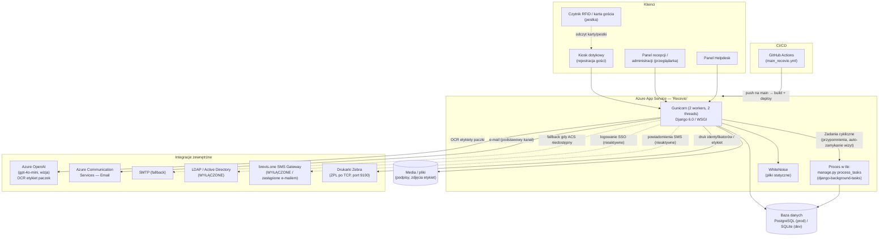
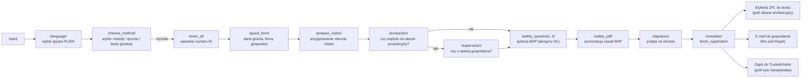
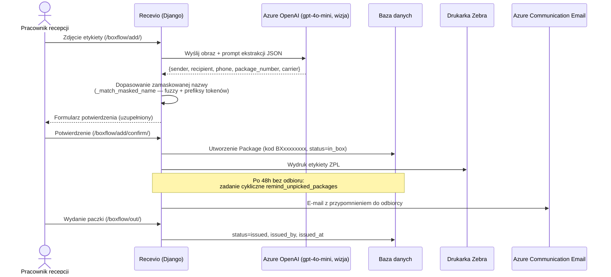
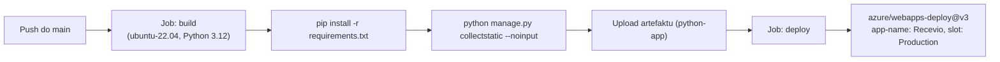

# Dokumentacja projektu Recevio

> **Uwaga:** Ten dokument został wygenerowany przy pomocy AI (Claude) na podstawie analizy kodu źródłowego repozytorium na dzień **2026-07-31**. Zawiera opis architektury, logiki biznesowej i stanu technicznego wyłącznie na podstawie kodu — nie zawiera żadnych danych osobowych ani sekretów. Traktuj go jako materiał pomocniczy do przeglądu przez zespół — przed wykorzystaniem w decyzjach biznesowych zweryfikuj go z osobami odpowiedzialnymi za projekt. Oznacz udostępnianie tego dokumentu jako "Wspomagane przez AI" zgodnie z polityką firmy.

---

## 1. Czym jest Recevio

**Recevio** to wewnętrzna aplikacja webowa **H. & J. Brüggen KG** do obsługi recepcji zakładu produkcyjnego. Łączy w sobie:

1. **Kiosk rejestracji gości** (ekran dotykowy przy wejściu) — samoobsługowa rejestracja odwiedzających, oświadczenia BHP, podpis elektroniczny, druk identyfikatora.
2. **Panel recepcji / administracji** — zarządzanie gośćmi, firmami, gospodarzami (hostami), zatwierdzanie wizyt, statystyki, eksport danych.
3. **BoxFlow** — moduł obsługi przesyłek/paczkomatu (skan etykiety, rozpoznawanie danych przez AI, wydawanie i przypominanie o odbiorze paczek).
4. **Helpdesk** — administracja użytkownikami i danymi słownikowymi (nadawcy/odbiorcy paczek).

Aplikacja jest jednomodułowym projektem **Django** (aplikacja `GuestBook` w projekcie `mysite`), wdrażanym na **Azure App Service** pod nazwą `Recevio`.

---

## 2. Status projektu (na 2026-07-31)

- Repozytorium liczy **136 commitów**, pierwszy commit: **2026-04-30**, ostatni: **2026-07-27** — projekt jest młody (~3 miesiące) i aktywnie rozwijany, głównie iteracyjnie przez PR-y scalane do `main`.
- **CI/CD działa automatycznie**: push do `main` uruchamia workflow GitHub Actions, który buduje aplikację i wdraża ją na Azure App Service (slot Production) — patrz [sekcja 9](#9-cicd).
- **Moduł BoxFlow (przesyłki)** jest obecnie najintensywniej rozwijaną częścią systemu (większość ostatnich commitów).
- **Funkcje obecne w kodzie, ale wyłączone / nieaktywne:**
  - **Rezerwacje wizyt** (`Reservation`, `ReservationCode`) — kompletny model danych i widoki istnieją, ale wszystkie trasy URL są zakomentowane w `GuestBook/urls.py` z adnotacją „Reservations disabled”.
  - **Logowanie przez LDAP/Active Directory** — zaimplementowany `LDAPBackend` (`GuestBook/backends.py`) jest wyłączony w `AUTHENTICATION_BACKENDS` z komentarzem „on-premise LDAP not reachable from Azure”. Obecnie działa wyłącznie standardowe logowanie Django (konta lokalne).
  - **Powiadomienia SMS** (gateway brevis.one) — kod (`GuestBook/sms_gateway.py`, SDK w `requirements_apps/`) pozostał w repozytorium, ale wywołania są zakomentowane w `views.py` z opisem „Replaced by email notifications” — powiadomienia do gospodarzy wysyłane są teraz e-mailem.
  - Rozpoznawanie etykiet AI przechodziło przez kilka iteracji (Azure AI Vision → Azure OpenAI) — ostatecznie ustabilizowano na **Azure OpenAI (`gpt-4o-mini`, wizja)**.

### ⚠️ Krytyczne ustalenie bezpieczeństwa / zgodności z RODO

Podczas analizy stwierdzono, że w repozytorium Git **są zacommitowane pliki, które nie powinny się tam znaleźć**, mimo że `.gitignore` je wyklucza (zostały dodane zanim wpisano je do `.gitignore`, więc git nadal je śledzi):

| Plik / katalog | Problem |
|---|---|
| `.env` | Zawiera **prawdziwe sekrety produkcyjne**: klucz Django (`DJANGO_SECRET_KEY`), hasło konta LDAP (`LDAP_BIND_PASSWORD`), hasło SMTP, hasło/klucz do bramki SMS, **klucz API Azure OpenAI** (`AZURE_OPENAI_KEY`) i inne. |
| `db.sqlite3` | Baza danych z historią gości — może zawierać dane osobowe (imię, nazwisko, telefon) realnych odwiedzających. |
| `debug.log` | Log aplikacji (do 3×3 MB rotacji) — może zawierać dane osobowe i szczegóły techniczne. |
| `media/signatures/`, `media/admin_signatures/` | Obrazy podpisów odręcznych gości i pracowników recepcji — dane osobowe / quasi-biometryczne. |

**To nie jest tylko drobna niedogodność — jeśli repozytorium było kiedykolwiek publiczne lub dostępne dla osób spoza zespołu, powyższe sekrety i dane osobowe są już potencjalnie ujawnione.** Zgodnie z wewnętrzną polityką firmy w zakresie incydentów bezpieczeństwa i ochrony danych, rekomendujemy:

1. **Natychmiastowe zgłoszenie tego faktu przez ustalone kanały zgłaszania incydentów** (Information Security / DPO), niezależnie od tego, czy repo jest prywatne.
2. **Rotację wszystkich sekretów** znajdujących się w `.env` (klucz Django, hasła LDAP/SMTP/SMS, klucz Azure OpenAI) — nawet jeśli repo jest prywatne, powinny zostać unieważnione i wygenerowane na nowo.
3. **Usunięcie tych plików z historii Gita** (nie tylko z bieżącego commita — `git rm --cached` samo w sobie nie wystarczy, bo pliki pozostają w historii) — to działanie wymaga świadomej decyzji zespołu/IT, ponieważ przepisanie historii wpływa na wszystkie klony repozytorium.
4. **Rewizję pod kątem RODO** danych w `db.sqlite3` i `media/` — ustalenie, czy to dane produkcyjne czy testowe, i czy ich przechowywanie w systemie kontroli wersji jest zgodne z zasadą minimalizacji danych.

Nie podjęto tu żadnych działań naprawczych — to świadoma decyzja, żeby nie ryzykować utraty pracy zespołu bez wyraźnej zgody. Chętnie pomogę to naprawić (rotacja kluczy w Azure, wyczyszczenie historii, poprawa `.gitignore`), jeśli zespół zdecyduje się to zlecić.

---

## 3. Architektura wysokopoziomowa



**Kluczowe cechy architektury:**
- Monolit Django, brak wydzielonych mikroserwisów ani API zewnętrznego (poza wewnętrznym `api/get-host/`).
- Brak frontendowego frameworka SPA — całość renderowana server-side (Django templates + Bootstrap 3 + `django-widget-tweaks`).
- Drukowanie odbywa się dwutorowo: (a) serwer wysyła surowy ZPL bezpośrednio do drukarki Zebra po TCP/IP, (b) endpointy `*_get_zpl` zwracają kod ZPL do przeglądarki do wydruku przez Zebra Browser Print (JS po stronie klienta).
- Operacje "wolne" (e-mail, druk) są odpalane w wątkach *fire-and-forget* z „soft timeout" (`_mark_timeout_later`), żeby nie blokować żądania HTTP — status zapisywany jest w polach `sms_status` / `print_status` modelu `Visitor` (`pending` → `sent/printed` / `timeout` / `error`).

---

## 4. Stos technologiczny

| Warstwa | Technologia |
|---|---|
| Język / runtime | Python 3.12 |
| Framework webowy | Django 6.0.4 |
| Serwer aplikacyjny | Gunicorn (WSGI), 2 workery × 2 wątki, timeout 120 s |
| Pliki statyczne | WhiteNoise (`RelaxedManifestStaticFilesStorage` — własna klasa tolerująca brakujące wpisy w manifeście) |
| Baza danych | PostgreSQL (produkcja, przez `DATABASE_URL` / `dj-database-url` + `psycopg2-binary`) lub SQLite (dev / fallback lokalny) |
| Zadania cykliczne | `django-background-tasks` (worker `process_tasks`, uruchamiany i pilnowany w `startup.sh`) |
| Formularze / UI | `django-crispy-forms`, `django-bootstrap3`, `django-widget-tweaks` |
| Autentykacja | `django.contrib.auth` (ModelBackend) + własny `LDAPBackend` (ldap3) — obecnie wyłączony |
| E-mail | Azure Communication Services (`azure-communication-email`) jako główny kanał, SMTP (`django.core.mail`) jako fallback |
| AI / OCR | Azure OpenAI (`openai` SDK, `AzureOpenAI`, deployment `gpt-4o-mini`, wizja) |
| SMS (nieaktywne) | brevis.one — własny SDK w `requirements_apps/brevis.one-PythonSDK-v23.01/` (swagger client) |
| PDF | PyMuPDF (`fitz`) — generowanie dokumentu BHP z wklejonym podpisem |
| Excel | `openpyxl`, `pandas` — import/eksport firm, gospodarzy, nadawców/odbiorców, listy gości |
| Obrazy | Pillow — obrót/normalizacja zdjęć etykiet paczek |
| i18n | wbudowany Django i18n, języki PL/EN, tłumaczenia w `locale/pl/LC_MESSAGES/django.po` |
| Hosting | Azure App Service (Linux), aplikacja `Recevio` |
| CI/CD | GitHub Actions (`.github/workflows/main_recevio.yml`) → `azure/webapps-deploy` |

---

## 5. Struktura repozytorium

```
RecevioMain/
├── manage.py
├── mysite/                     # konfiguracja projektu Django
│   ├── settings.py             # ustawienia (DB, e-mail, LDAP, SMS, i18n, logowanie)
│   ├── urls.py                 # główny routing (i18n_patterns + /nimda/ admin + GuestBook.urls)
│   ├── storage.py              # RelaxedManifestStaticFilesStorage (WhiteNoise)
│   ├── wsgi.py / asgi.py
├── GuestBook/                  # jedyna aplikacja domenowa
│   ├── models.py                # Host, Company, Visitor, TrustedVisitor, AdminProfile,
│   │                             # Reservation, ReservationCode, Sender, Recipient,
│   │                             # KioskSettings, Package
│   ├── views.py                 # ~4000 linii — cała logika biznesowa (patrz sekcja 7)
│   ├── forms.py                 # formularze (rejestracja, paczki, helpdesk)
│   ├── urls.py                  # routing modułu GuestBook
│   ├── admin.py                 # rejestracja modeli w Django Admin (/nimda/)
│   ├── backends.py              # LDAPBackend (wyłączony)
│   ├── mail_service.py          # wysyłka e-mail przez Azure Communication Services + fallback SMTP
│   ├── sms_gateway.py           # klient brevis.one SMS (wyłączony)
│   ├── task.py                  # zadania cykliczne (background_task)
│   ├── utils.py                 # generowanie PDF BHP, czyszczenie URL "next"
│   ├── utils/ops.py              # `run_with_timeout` (wątek + join z limitem czasu)
│   ├── management/commands/
│   │   ├── close_old_visitors.py       # jednorazowe zamykanie zaległych wizyt (uruchamiane też z task.py)
│   │   └── remind_unpicked_packages.py # przypomnienia o nieodebranych paczkach >48h
│   ├── templatetags/user_groups.py
│   ├── templates/
│   │   ├── kiosk/                # ekrany kiosku rejestracji
│   │   ├── panel/                # panel recepcji/administracji
│   │   └── boxflow/              # moduł przesyłek
│   ├── static/pdf/               # szablony PDF BHP (PL/EN)
│   ├── Print_templates/          # szablony ZPL (identyfikator gościa, etykieta paczki)
│   └── migrations/               # 35 migracji — historia ewolucji modelu danych
├── middleware/clean_next.py     # sanityzacja parametru ?next= (ochrona przed open-redirect)
├── requirements_apps/            # wendorowany SDK brevis.one (SMS, obecnie nieużywany w kodzie)
├── locale/pl/LC_MESSAGES/        # tłumaczenia PL
├── requirements.txt
├── startup.sh                    # komenda startowa Azure App Service (migracje + worker + gunicorn)
├── convert_chip.py               # skrypt pomocniczy: konwersja UID karty RFID (hex) → ID dziesiętne
└── .github/workflows/main_recevio.yml
```

---

## 6. Model danych

```mermaid
erDiagram
    HOST ||--o{ COMPANY : "opiekuje się"
    HOST ||--o{ VISITOR : "przyjmuje"
    COMPANY ||--o{ VISITOR : "reprezentowana przez"
    VISITOR ||--o| RESERVATION : "powstaje z (opcjonalnie)"
    USER ||--o| ADMINPROFILE : "profil recepcji/admina"
    USER ||--o{ VISITOR : "zatwierdza / przyjmuje zwrot"
    USER ||--o{ RESERVATION : "tworzy"
    RESERVATION ||--|| RESERVATIONCODE : "kod dostępu"
    COMPANY ||--o{ RESERVATION : ""
    HOST ||--o{ RESERVATION : ""
    SENDER ||--o{ PACKAGE : "nadaje"
    RECIPIENT ||--o{ PACKAGE : "odbiera"
    USER ||--o{ PACKAGE : "tworzy/wydaje/edytuje"

    HOST {
        string host_name
        string phone
        string email
    }
    COMPANY {
        string company_name
        fk host_name
    }
    VISITOR {
        string first_name
        string last_name
        string phone
        fk factory "Company (opcjonalne)"
        string company_name_text "firma wpisana ręcznie"
        text visit_purpose
        fk host
        string visitor_id "numer ID / hex UID karty"
        bool production_area
        bool with_supervision
        bool safety_acknowledged
        image signed "podpis"
        datetime start_time
        datetime end_time
        bool badge_returned
        string language "pl/en"
        string safety_question_1_2_3
        bool approved
        fk approved_by "User"
        bool known_guest
        fk returned_by "User"
        fk reservation "opcjonalne 1:1"
        string sms_status "pending/sent/timeout/error/skipped"
        string print_status "pending/printed/timeout/error/skipped"
        bool id_issued
    }
    TRUSTEDVISITOR {
        string first_name
        string last_name
        string phone
        string company
        text visit_purpose
        string host_name
        string host_phone
        string badge_id "unikalny, powiązany z kartą RFID"
    }
    ADMINPROFILE {
        fk user "1:1"
        image signature
        string phone_number
        string printer_address
        int printer_port
    }
    RESERVATION {
        fk user
        string visitor_first_name_last_name
        fk company
        fk host
        date date
        time time
        bool conference_needed
        string conference_room
        string status "sent/arrived/completed/cancelled"
        string sms_status
        datetime cancelled_at
    }
    RESERVATIONCODE {
        fk reservation "1:1"
        string code "6 cyfr"
        int usage_count
        int max_uses
    }
    SENDER {
        string name "unikalny"
    }
    RECIPIENT {
        string name "unikalny"
        string email
        string phone
    }
    KIOSKSETTINGS {
        string printer_address
        int printer_port
    }
    PACKAGE {
        datetime delivered_at
        fk sender
        fk recipient
        string code "unikalny, np. BXxxxxxxxx"
        string label_code "nr z etykiety przewoźnika"
        string status "in_box/issued"
        text staff_comment
        image label_photo
        datetime reminder_sent_at
        fk collected_by "Recipient"
        string collected_by_name "wolny tekst"
        string phone_number
        datetime issued_at
        fk issued_by "User"
        fk updated_by "User"
    }
```

**Uwagi do modelu:**
- `Visitor.company_display` (property) — priorytetyzuje: firma z listy (`factory` FK) → tekst wpisany ręcznie (`company_name_text`) → „No company”. To wzorzec spotykany kilkukrotnie w kodzie (np. `_company_display()` w `views.py`), pozwalający recepcji wpisać firmę spoza słownika.
- `Visitor.is_present()` — gość jest „obecny”, jeśli nie ma `end_time` **lub** identyfikator nie został zwrócony (`badge_returned=False`) — czyli oba warunki muszą być spełnione, by uznać wizytę za faktycznie zakończoną.
- `ReservationCode.can_use()` / `register_use()` — kod rezerwacji ma limit użyć (domyślnie 3) — mechanizm chroniący przed wielokrotnym/nieautoryzowanym użyciem tego samego kodu (funkcja obecnie nieużywana, bo rezerwacje są wyłączone w routingu).
- `Package.code` z prefiksem `BX` (BoxFlow) generowany losowo (`generate_package_code`), niezależny od numeru śledzenia przewoźnika (`label_code`).

---

## 7. Moduły funkcjonalne i logika biznesowa

### 7.1 Kiosk rejestracji gościa — ścieżka "od zera" (manualna)



Kluczowe reguły biznesowe w `finish_registration`:
- Tryb **manualny** → `approved=False`, `known_guest=False` — wizyta trafia do kolejki **„oczekujące na zatwierdzenie”** (`/approvals/`), którą przegląda recepcja.
- Tryb **karta/pestka (badge)** → `approved=True`, `known_guest=True` od razu (rozpoznany gość powracający) — a jeśli to pierwsze użycie danej karty, tworzony jest wpis `TrustedVisitor`, żeby kolejne wizyty tej samej osoby (po tej samej karcie) przebiegały szybciej, bez pełnego formularza.
- Kolor identyfikatora zależy od nadzoru: **czerwony** = porusza się po zakładzie tylko z gospodarzem, **zielony** = może poruszać się bez gospodarza.
- E-mail do gospodarza zawiera ostrzeżenie o alergenach, jeśli gość potwierdził uczulenie w pytaniu BHP nr 3.
- Po zakończeniu dane robocze usuwane są z sesji (`badge_id`, `registration_mode`, `visitor_data`, `safety_answers`).

### 7.2 Wejście przez kartę / "pestkę" (RFID) — gość zaufany

Alternatywna, równoległa ścieżka dla gości rozpoznanych po identyfikatorze karty (`TrustedVisitor.badge_id`): `enter_badge` → (jeśli karta znaleziona w `TrustedVisitor`) dane są **wstępnie wypełnione** z ostatniej wizyty i użytkownik przechodzi od razu do `production_form`, pomijając formularz danych osobowych. Dla kart nierozpoznanych trasa zawraca do standardowego `guest_form_badge`.

Skrypt `convert_chip.py` (poza główną aplikacją, narzędzie pomocnicze) pokazuje sposób dekodowania surowego UID karty RFID (hex, little-endian z bajtów 2–4) na liczbowy identyfikator — najpewniej używany przy konfiguracji czytników kart przypisywanych do `visitor_id` / `badge_id`.

### 7.3 Wyjście gościa (kiosk)

`/kiosk/exit/` (`exit_badge_view`) → `exit_done_view` — skanowanie/wpisanie identyfikatora przy wyjściu w celu odnotowania zwrotu identyfikatora (`badge_returned`, `end_time`) bez konieczności podchodzenia do recepcji.

### 7.4 Rezerwacje wizyt — *zaimplementowane, ale wyłączone*

Pełny model (`Reservation`, `ReservationCode`) i widoki (tworzenie, edycja, anulowanie, check-in po 6-cyfrowym kodzie, ponowna wysyłka SMS, sala konferencyjna: VIP/Kreatywna/Kameralna) istnieją w kodzie, ale **wszystkie odpowiadające trasy URL są zakomentowane** w `GuestBook/urls.py`. Funkcja jest gotowa do włączenia, ale obecnie niedostępna dla użytkowników.

### 7.5 Panel recepcji / administracji (`/panel/`)

| Funkcja | Opis |
|---|---|
| **Dashboard** (`/panel/`) | Lista zatwierdzonych gości z wyszukiwarką (imię, nazwisko, firma, cel wizyty, gospodarz, obecność na produkcji/nadzór — rozpoznawane też słowa kluczowe PL/EN typu „tak/nie”). |
| **Obecni na terenie** (`/nearby/`) | Wszyscy z niezwróconym identyfikatorem i bez `end_time`. |
| **Zwrot identyfikatora** (`/return/<pk>/`) | Odnotowanie zwrotu, zamyka też powiązaną rezerwację jako `completed`. |
| **Statystyki** (`/statistics/`) | Zestawienia tygodniowe/miesięczne wizyt. |
| **Zatwierdzanie** (`/approvals/`, `/approve/<pk>/`) | Kolejka gości zarejestrowanych manualnie — recepcja zatwierdza wizytę i decyduje, czy oznaczyć gościa jako „znanego” (`known_guest`). |
| **Eksport Excel** (`/export_excel/`) | Eksport listy gości do XLSX (`openpyxl`). |
| **Szczegóły / edycja gościa** (`/guest/<pk>/`, `/visitor/<pk>/edit/`) | Podgląd i korekta danych wizyty. |
| **Generowanie PDF BHP** (`/generate_bhp_pdf/<pk>/`) | Dokument z wklejonym podpisem gościa i pracownika recepcji (patrz [7.7](#77-generowanie-dokumentu-bhp-pdf)). |
| **Ponowny druk identyfikatora** (`/reprint/<pk>/`) | Odtworzenie etykiety ZPL. |
| **Firmy / Gospodarze / Zaufani goście** | CRUD + import z Excela (`company_import`, `host_import`) dla słowników używanych w formularzu rejestracji. |
| **Profil** (`/profile/`) | Zmiana hasła, podpis cyfrowy pracownika recepcji, adres/port własnej drukarki (`AdminProfile`). |
| **Helpdesk — użytkownicy** (`/helpdesk/users/`) | Zarządzanie kontami i przypisaniem do grup — dostępne tylko dla grupy `Recevio_Helpdesk`. |

### 7.6 BoxFlow — obsługa paczek / paczkomatu



Kluczowe elementy logiki:
- **`_call_ai_single`** — wysyła zdjęcie etykiety do Azure OpenAI (deployment `gpt-4o-mini`) z promptem instruującym model, by: czytał też tekst obrócony (etykiety kurierskie bywają obrócone o 90/180/270°), rozpoznawał przewoźnika (FedEx, UPS, DHL, InPost, GLS), **nigdy nie zgadywał** brakujących/zamaskowanych danych (lepiej pusty string niż błędne domysły), i zwracał wyłącznie czysty JSON.
- **`_match_masked_name`** — częsty w Polsce przypadek: paczkomaty maskują część nazwiska gwiazdkami (np. `RAF*** ZAW***`). Funkcja dopasowuje taki zapis do istniejącej bazy `Recipient` w trzech krokach: (1) dokładne dopasowanie po normalizacji (usunięcie form prawnych typu „S.A.” / „Sp. z o.o.” traktowanych jako tożsame), (2) dopasowanie rozmyte (`difflib`, próg pewności 0.75), (3) dopasowanie po prefiksach tokenów. Ma pokrycie testami jednostkowymi (`tests.py`).
- **Przypomnienia o odbiorze** — `management/commands/remind_unpicked_packages.py` wysyła jednorazowe (`reminder_sent_at`) e-maile zbiorcze do odbiorcy o wszystkich jego paczkach leżących >48h, uruchamiane cyklicznie przez `django-background-tasks` **oraz** ręcznie z panelu (`/boxflow/inbox/send-reminders/`).
- **Zarządzanie słownikami** (Helpdesk) — nadawcy (`Sender`) i odbiorcy (`Recipient`) z importem z Excela; edycja paczki ograniczona (`PackageEditFormLimited`) dla zwykłej recepcji (bez zmiany daty dostawy) vs. pełny formularz dla Helpdesku.
- **Widok publiczny odbioru** (`/kiosk/pickup/`) — samoobsługowy ekran do potwierdzenia odbioru paczki.

### 7.7 Generowanie dokumentu BHP (PDF)

`GuestBook/utils.py::generate_bhp_pdf` — używa **PyMuPDF** do wstawienia w gotowy szablon PDF (PL/EN, `GuestBook/static/pdf/zasady_bhp_{lang}.pdf`) daty, nazwy firmy, imienia i nazwiska gościa, odpowiedzi na pytania BHP oraz **wklejonych obrazów podpisów** — gościa i pracownika recepcji (z domyślnym podpisem, jeśli pracownik nie ma własnego zapisanego w `AdminProfile`).

### 7.8 Drukowanie identyfikatorów i etykiet (Zebra / ZPL)

Dwa niezależne mechanizmy druku:
1. **Bezpośredni druk serwerowy** — `send_zpl_to_printer()` otwiera surowe połączenie TCP do portu 9100 drukarki Zebra i wysyła kod ZPL. Adres drukarki pochodzi z profilu pracownika (`AdminProfile.printer_address/port`) lub domyślnych ustawień (`KioskSettings`, domyślnie `10.30.40.150:9100`). Operacja jest asynchroniczna (`print_badge_async`) z „miękkim” limitem czasu — jeśli drukarka nie odpowie w 5 s, status w bazie ustawiany jest na `timeout`, a nie blokuje żądania HTTP.
2. **Druk po stronie przeglądarki** — endpointy `*_get_zpl` (`/boxflow/<pk>/zpl/`, `/visitor/<pk>/zpl/`) zwracają surowy ZPL do wykorzystania przez **Zebra Browser Print** (komponent JS działający lokalnie na komputerze recepcji), gdy drukowanie ma się odbyć z przeglądarki klienta zamiast bezpośrednio z serwera Azure (co ma sens, bo drukarki znajdują się w sieci lokalnej zakładu, a serwer działa w chmurze Azure).

---

## 8. Integracje zewnętrzne (usługi)

| Usługa | Rola w systemie | Status |
|---|---|---|
| **Azure OpenAI** (`gpt-4o-mini`, wizja) | Odczyt i ekstrakcja danych z zdjęć etykiet przesyłek (BoxFlow) | ✅ Aktywne |
| **Azure Communication Services — Email** | Główny kanał e-mail: powiadomienia do gospodarzy o przybyciu gościa, przypomnienia o nieodebranych paczkach | ✅ Aktywne (podstawowy kanał) |
| **SMTP** (`django.core.mail`, backend standardowy) | Zapasowy kanał e-mail, używany automatycznie, gdy ACS nie jest skonfigurowany lub zwróci błąd | ✅ Aktywne jako fallback |
| **LDAP / Active Directory** (`ldap3`) | Docelowo: logowanie SSO kontem domenowym + automatyczne przypisanie do grup `Recevio_*` na podstawie grup AD | ⛔ **Wyłączone** — serwer on-premise nieosiągalny z Azure; obecnie tylko konta lokalne Django |
| **brevis.one SMS Gateway** | Docelowo: SMS do gospodarza o przybyciu gościa | ⛔ **Wyłączone** — zastąpione e-mailem (kod i SDK pozostały w repo) |
| **Drukarki Zebra** (ZPL, TCP port 9100) | Druk identyfikatorów gości i etykiet paczek | ✅ Aktywne |
| **PostgreSQL** | Baza danych produkcyjna | ✅ Aktywne (przez `DATABASE_URL`) |
| **SQLite** | Baza danych dla środowiska developerskiego / fallback | ✅ Aktywne lokalnie |
| **Azure App Service** (`Recevio`) | Hosting produkcyjny (Linux, Gunicorn) | ✅ Aktywne |
| **GitHub Actions** | CI/CD — build + `collectstatic` + deploy na Azure | ✅ Aktywne |
| **django-background-tasks** | Kolejka zadań cyklicznych (przypomnienia, auto-zamykanie wizyt) | ✅ Aktywne — wymaga osobnego procesu `process_tasks` |

---

## 9. CI/CD



Uwagi:
- Workflow (`.github/workflows/main_recevio.yml`) uruchamia się na push do `main` oraz ręcznie (`workflow_dispatch`).
- Krok `collectstatic` w CI używa **placeholder-owego** klucza (`build-only-placeholder-key`) i `DEBUG=False` — to tylko na potrzeby budowania plików statycznych, nie ma wpływu na realną konfigurację produkcyjną (ta pochodzi ze zmiennych środowiskowych Azure App Service).
- Wdrożenie wykorzystuje `publish-profile` przechowywany jako sekret repozytorium (`AZUREAPPSERVICE_PUBLISHPROFILE_...`).
- **Nie ma etapu testów w pipeline** — mimo że w repozytorium istnieją testy jednostkowe (`GuestBook/tests.py`), CI nie uruchamia `python manage.py test` przed wdrożeniem. To realna luka w procesie — błąd wykryty testami mógłby i tak trafić na produkcję.
- Uruchomienie na Azure App Service odbywa się przez `startup.sh`: migracje bazy → uruchomienie i nadzorowanie (auto-restart w pętli) procesu `process_tasks` w tle → `gunicorn mysite.wsgi --workers 2 --threads 2 --timeout 120`.

---

## 10. Uwierzytelnianie i autoryzacja

- Obecnie jedyny aktywny backend logowania to standardowy `django.contrib.auth.backends.ModelBackend` — konta muszą być tworzone ręcznie (np. przez Django Admin pod `/nimda/`), bo logowanie LDAP jest wyłączone.
- Docelowy model grup (nadawany automatycznie przez `LDAPBackend.assign_groups`, gdy LDAP jest aktywny, a obecnie wymagający ręcznego nadania w Django Admin):

| Grupa | Przeznaczenie (na podstawie użycia w kodzie) |
|---|---|
| `Recevio_Admin` | Pełne uprawnienia administracyjne (ustawia też `is_staff=True`) |
| `Recevio_Reception` | Obsługa recepcji — zatwierdzanie wizyt, zwroty identyfikatorów, edycja rezerwacji/wizyt |
| `Recevio_Helpdesk` | Zarządzanie użytkownikami, słownikami BoxFlow (nadawcy/odbiorcy), pełna edycja paczek |
| `Recevio_User` | Dostęp do rezerwacji (funkcja obecnie wyłączona w routingu) |
| `Recevio_BoxFlow` | Dostęp do modułu przesyłek (`_can_boxflow`) |

- Uwaga: istnieją też **starsze, nieużywane już funkcje** `is_reception`/`is_admin`/`is_user` sprawdzające grupy o innych nazwach (`Reception`, `Admin`, `User` — bez prefiksu `Recevio_`) — pozostałość po wcześniejszej wersji systemu uprawnień; obecna logika autoryzacji w większości widoków opiera się na grupach z prefiksem `Recevio_`.
- Middleware `CleanNextMiddleware` oraz funkcja `clean_next_url` chronią przed **open-redirect** przez parametr `?next=`, dekodując go wielokrotnie i odrzucając wartości próbujące zapętlić się przez `/login`.

---

## 11. Zadania cykliczne (background jobs)

| Zadanie | Częstotliwość | Co robi |
|---|---|---|
| `close_expired_visitors_task` | co 1 h | Automatycznie zamyka wizytę (`end_time = now`) gościom **rozpoznanym po karcie** (`known_guest=True`), którzy są na obszarze produkcyjnym i nie zwrócili identyfikatora **8 godzin** po wejściu. Dotyczy tylko identyfikatorów w formacie 8-znakowego hex (UID karty RFID) — nie manualnie wpisywanych numerów. |
| `remind_unpicked_packages_task` | co 1 h | Uruchamia komendę `remind_unpicked_packages` — wysyła jednorazowe e-maile o paczkach leżących w paczkomacie **>48h**. |

Oba zadania są rejestrowane idempotentnie (`schedule_recurring_tasks()`) — sprawdzają, czy dane zadanie nie jest już zaplanowane, zanim je dodadzą, żeby restart aplikacji nie mnożył wpisów w kolejce. Wymagają **osobnego procesu roboczego** (`manage.py process_tasks`), którego Azure App Service **nie nadzoruje domyślnie** — dlatego `startup.sh` uruchamia go w pętli z automatycznym restartem w razie awarii.

Jest też oddzielna komenda zarządzająca `close_old_visitors` (podobna logika, ale filtruje też po `approved=True` i wymaga formatu ID `[A-Fa-f0-9]{8}`) — częściowe zdublowanie logiki z `task.py::close_expired_visitors_task`, warte ujednolicenia.

---

## 12. Testy

`GuestBook/tests.py` zawiera testy jednostkowe dla:
- Dopasowywania zamaskowanych nazw nadawców/odbiorców (`_match_masked_name`) — w tym obsługi form prawnych (S.A. / Sp. z o.o.) i odrzucania dopasowań o niskiej pewności.
- Oznaczania paczki jako wydanej (`_mark_package_issued`) — zarówno dla zarejestrowanego odbiorcy, jak i wpisanego ręcznie nazwiska.
- Komendy `remind_unpicked_packages` — wysyłka tylko dla paczek starszych niż 48h i brak powtórnej wysyłki.

Pokrycie testami jest **ograniczone do modułu BoxFlow** — brak testów dla głównego przepływu rejestracji gościa, logiki uprawnień czy generowania PDF/ZPL.

---

## 13. Zidentyfikowany dług techniczny i rekomendacje

Poza opisanym w [sekcji 2](#2-status-projektu-na-2026-07-31) krytycznym problemem z sekretami/danymi osobowymi w repozytorium:

1. **`DEBUG = True` jest zahardkodowane** w `mysite/settings.py` (nie czytane ze zmiennej środowiskowej) — oznacza to, że nawet na produkcji Django pokazuje szczegółowe strony błędów ze stack trace, co może ujawniać wewnętrzne detale aplikacji. Rekomendacja: sterować przez zmienną środowiskową i wymusić `False` na produkcji.
2. **`ALLOWED_HOSTS = ['*']`** — brak ograniczenia do właściwej domeny Azure, co osłabia część zabezpieczeń Django (m.in. ochronę przed atakami Host header).
3. **`SMS_VERIFY_SSL = False`** oraz `verify_ssl=False` w kliencie SMS gateway — wyłączona weryfikacja certyfikatu TLS (nawet jeśli kod jest obecnie nieużywany, warto to poprawić przed ewentualnym przywróceniem).
4. **Brak testów w pipeline CI/CD** — mimo istniejących testów jednostkowych, `main_recevio.yml` ich nie uruchamia przed wdrożeniem.
5. **Zduplikowana logika** zamykania przeterminowanych wizyt (`task.py::close_expired_visitors_task` vs. `management/commands/close_old_visitors.py`) z lekko różnymi kryteriami filtrowania — ryzyko rozjazdu zachowania.
6. **Martwy kod / pozostałości** — cały SDK `brevis.one` (`requirements_apps/`) i logika SMS pozostają w repozytorium mimo wyłączenia funkcji; podobnie moduł rezerwacji (kompletny, ale całkowicie odcięty od routingu). Warto rozważyć: albo świadome utrzymanie „na później”, albo wydzielenie/usunięcie, żeby nie mylić przyszłych osób pracujących nad kodem.
7. **Plik `news`** w katalogu głównym repo to zapis rozmowy/notatek deweloperskich (nie jest kodem wykonywalnym mimo rozszerzenia sugerującego skrypt) — kandydat do usunięcia lub przeniesienia poza repozytorium.
8. Zgodnie z firmową polityką dot. treści wspomaganych przez AI: cała logika w tym repozytorium (widoczne komentarze i commity) była w dużej mierze rozwijana z pomocą asystenta AI — warto utrzymywać code review przez człowieka jako obowiązkowy etap przed scaleniem do `main`, szczególnie dla zmian dotyczących bezpieczeństwa, uprawnień i danych osobowych gości.

---

## 14. Podsumowanie stanu na dziś

| Obszar | Stan |
|---|---|
| Rejestracja gości (kiosk) | ✅ W pełni działające, aktywnie używane |
| Panel recepcji / statystyki / eksport | ✅ W pełni działające |
| BoxFlow (przesyłki) | ✅ Aktywnie rozwijane, najświeższe funkcje w projekcie |
| Rezerwacje wizyt | 🚧 Zaimplementowane, ale wyłączone w routingu |
| Logowanie LDAP/AD | ⛔ Wyłączone (brak łączności on-premise ↔ Azure) |
| SMS do gospodarzy | ⛔ Wyłączone, zastąpione e-mailem |
| CI/CD do Azure | ✅ Działa automatycznie z `main` |
| Testy automatyczne | 🚧 Istnieją, ale ograniczone do BoxFlow i nie są częścią CI |
| Bezpieczeństwo/RODO | ⚠️ **Wymaga natychmiastowej uwagi** — patrz sekcja 2 |
